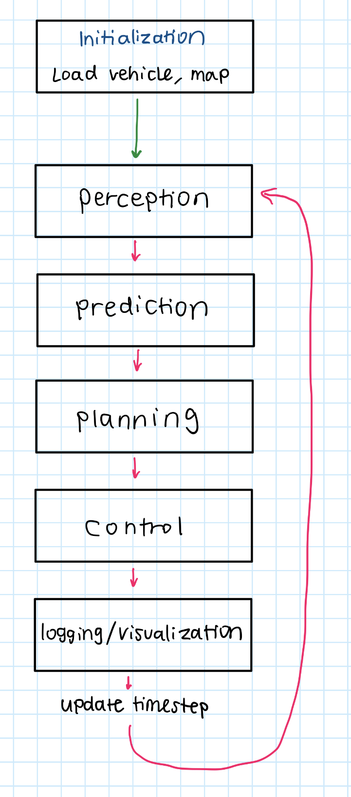

# MPC CARLA

## **Overview**

This is an autonomous vehicle control system using Model Predictive Control (MPC) in CARLA. 

The system:

1. Plans optimal trajectories considering vehicle dynamics and obstacles
2. Controls the vehicle to follow these trajectories
3. Uses a Frenet frame formulation for path following

### **Main Components Flow**

1. **Initialization**: sets up CARLA connection, spawns ego vehicle, initializes world model, initializes the agent
2. **Perception**: update the states of the ego vehicle and all actors
3. **Prediction**: predict the movements of all obstacles/actors
4. **Planning**: plan a trajectory by solving an optimization problem subject to vehicle dynamics (bicycle model in Frenet frame), state/input constraints, and collision avoidance constraints
5. **Control**: apply control inputs to follow the planned trajectory
6. **Logging/Visualization**: log the actor positions, velocities, etc. as well as predictions of agents at each point, etc. Additionally, visualize the planned trajectory.

## **Perception**

### **Update with Ground Truth (Temporary)**

- Since the primary focus of this project is the planning + control steps, for now, we will update the states of the ego and actors with ground truth.

## **Prediction**

### **Constant Velocity Model**

**Continuous-Time Dynamics**

- For an obstacle with state $X=[x,y,v_x,v_y]^T$…
    
    $$
    \begin{aligned}
    \dot x&=v_x\\
    \dot y&=v_y\\
    \dot v_x&=0\\
    \dot v_y&=0
    \end{aligned}
    $$
    
    - Since we’re assuming constant velocity, the acceleration $\dot v_x,\dot v_y$ is zero

**Discrete-Time Dynamics**

- For a prediction horizon $N$ with timestep $\Delta t$, the predicted states are:
    
    $$
    \begin{aligned}
    x_{k+1}&=x_k+v_{x,k}\Delta t\\
    y_{k+1}&=y_k+v_{y,k}\Delta t\\
    v_{x,k+1}&=v_{x,k}\\
    v_{y,k+1}&=v_{y,k}
    \end{aligned}
    $$
    
- In matrix form, this can be written as:
    
    $$
    \begin{bmatrix}
    x_{k+1}\\
    y_{k+1}\\
    v_{x,k+1}\\
    v_{y,k+1}
    \end{bmatrix}=
    \begin{bmatrix}
    1 & 0 & \Delta t & 0\\
    0 & 1 & 0 & \Delta t\\
    0 & 0 & 1 & 0\\
    0 & 0 & 0 & 1
    \end{bmatrix}
    \begin{bmatrix}
    x_{k}\\
    y_{k}\\
    v_{x,k}\\
    v_{y,k}
    \end{bmatrix}
    $$
    

## **Planning**

### **Vehicle Dynamics**

**Global Dynamics (Continuous)**

$$
\begin{aligned}
\dot x(t)&=v(t)\cos(\psi(t)+\beta(t))\\
\dot y(t)&=v(t)\sin(\psi(t)+\beta(t))\\
\dot\psi(t)&=\frac{1}{l_r}v(t)\sin(\beta(t))\\
\dot v(t)&=a(t)\\
\beta(t)&=\tan^{-1}\left(\frac{l_r}{l_f+l_r}\tan(\delta_f(t))\right)
\end{aligned}
$$

**Frenet Frame Dynamics (Continuous)**

$$
\begin{aligned}
\dot s(t)&=\frac{v(t)\cos(\beta(t)+e_\psi(t))}{1-\kappa(s(t))e_y(t)}\\
\dot e_y(t)&=v(t)\sin(\beta(t)+e_\psi(t))\\
\dot e_\psi(t)&=\frac{v(t)\sin(\beta(t))}{l_r}-\dot s(t)\kappa(s(t))\\
\dot v(t)&=a(t)\\
\beta(t)&=\tan^{-1}\left(\frac{l_r}{l_f+l_r}\tan(\delta_f(t))\right)
\end{aligned}
$$

**Relationship between Global and Frenet Coordinates**

$$
\begin{aligned}
e_y&=
(y(t)-y_{ref})\cos(\psi_{ref})-
(x(t)-x_{ref})\sin(\psi_{ref})\\
e_\psi&=
\psi(t)-\psi_{ref}\\
s&=s_{ref}+
(x(t)-x_{ref})\cos(\psi_{ref})+
(y(t)-y_{ref})\sin(\psi_{ref})

\end{aligned}
$$

**Discretized Dynamics (Euler’s Method)**

$$
\red{
\begin{aligned}
s_{k+1}&=s_k+\Delta t\cdot \frac{v_k\cos(\beta_k+e_{\psi,k})}{1-\kappa(s_k)e_{y,k}}\\
e_{y,k+1}&=e_{y,k}+\Delta t\cdot v_k\sin(\beta_k+e_{\psi,k})\\
e_{\psi,k+1}&=e_{\psi,k}+\Delta t\cdot\left(\frac{v_k\sin(\beta_k)}{l_r}-\dot s_k\kappa(s_k)\right)\\
v_{k+1}&=v_k+\Delta t\cdot a_k\\
\beta_{k+1}&=\tan^{-1}\left(\frac{l_r}{l_f+l_r}\tan(\delta_{f,k})\right)
\end{aligned}
}
$$

**Discretized Dynamics (RK4 Method)**

- Consider state vector $X$ and dynamics $\dot X=f(X,u)$:
    - For our bicycle model:
        
        $$
        \begin{aligned}
        f_s(X,u)&=\frac{v(t)\cos(\beta(t)+e_\psi(t))}{1-\kappa(s(t))e_y(t)}\\
        f_{e_y}(X,u)&=v(t)\sin(\beta(t)+e_\psi(t))\\
        f_{e_\psi}(X,u)&=\frac{v(t)\sin(\beta(t))}{l_r}-\dot s(t)\kappa(s(t))\\
        f_v(X,u)&=a(t)\\
        \beta(t)&=\tan^{-1}\left(\frac{l_r}{l_f+l_r}\tan(\delta_f(t))\right)
        \end{aligned}
        $$
        
    - Then, for each state:
        
        $$
        \begin{aligned}
        k_{1,s}&=f_s(X_k,u_k)\\
        k_{1,e_y}&=f_{e_y}(X_k,u_k)\\
        k_{1,e_\psi}&=f_{e_\psi}(X_k,u_k)\\
        k_{1,v}&=f_{e_v}(X_k,u_k)\\
        \end{aligned}
        $$
        
        $$
        \begin{aligned}
        k_{2,s}&=f_s\left(X_k
        +\frac{\Delta t}{2}[k_{1,s},k_{1,e_y},k_{1,e_\psi},k_{1,v}]^T
        ,u_k\right)\\
        k_{2,e_y}&=f_{e_y}\left(X_k
        +\frac{\Delta t}{2}[k_{1,s},k_{1,e_y},k_{1,e_\psi},k_{1,v}]^T
        ,u_k\right)\\
        k_{2,e_\psi}&=f_{e_\psi}\left(X_k
        +\frac{\Delta t}{2}[k_{1,s},k_{1,e_y},k_{1,e_\psi},k_{1,v}]^T
        ,u_k\right)\\
        k_{2,v}&=f_{e_v}\left(X_k
        +\frac{\Delta t}{2}[k_{1,s},k_{1,e_y},k_{1,e_\psi},k_{1,v}]^T
        ,u_k\right)\\
        \end{aligned}
        $$
        
        Similarly for $k_3$ and $k_4$
        
    - Finally:
        
        $$
        \red{
        \begin{aligned}
        s_{k+1}&=s_k+\frac{\Delta t}6(k_{1,s}+2k_{2,s}+2k_{3,s}+k_{4,s})\\
        e_{y,k+1}&=e_{y,k}+\frac{\Delta t}6(k_{1,e_y}+2k_{2,e_y}+2k_{3,e_y}+k_{4,e_y})\\
        e_{\psi,k+1}&=e_{\psi,k}+\frac{\Delta t}6(k_{1,e_\psi}+2k_{2,e_\psi}+2k_{3,e_\psi}+k_{4,e_\psi})\\
        v_{k+1}&=v_k+\frac{\Delta t}6(k_{1,v}+2k_{2,v}+2k_{3,v}+k_{4,v})\\
        \end{aligned}
        }
        $$
        

### **Optimization Problem**

$$
\begin{aligned}
\min_{x_{0:N},u_{0:N-1}}&
\sum_{k=0}^{N-1}
Q_{e_y}e_{y,k}^2+
Q_{e_\psi}e_{\psi,k}^2+
Q_v(v_k-v_{des})^2+
R_aa_k^2+
R_{\delta_f}\delta_{f,k}^2\\
\text{s.t. }&
\text{vehicle dynamics}\\
&
\text{initial constraints}\\
&|e_{y,k}|\le e_{y,max}\\
&v_{min}\le v_k\le v_{max}\\
&|\delta_{f,k}|\le\delta_{f,max}\\
&a_{min}\le a_k\le a_{max}\\
&|\dot\delta_{f,k}|\le\dot\delta_{f,max}\\
&|\dot a_k|\le j_{max}\\
& 2r_{ca}=d_{min}\le \sqrt{
(x_k-x_{obs,k}^i)^2+(y_k-y_{obs,k}^i)^2
}\qquad
\forall k\in[0,N],\,
\forall i\in[1,n_{obs}]
\end{aligned}
$$

where:

- Cost weights:
    - $Q_{e_y},Q_{e_\psi},Q_v$: state cost weights
    - $R_a,R_{\delta_f}$: input cost weights
- $e_y$ constraints:
    
    $$
    |e_{y,k}|\le e_{y,max}
    $$
    
- State constraints:
    
    $$
    v_{min}\le v_k\le v_{max}
    $$
    
- Input constraints:
    
    $$
    \begin{aligned}
    |\delta_{f,k}|&\le\delta_{f,max}\\
    a_{min}&\le a_k\le a_{max}
    \end{aligned}
    $$
    
- Input rate constraints:
    
    $$
    \begin{aligned}
    |\dot\delta_{f,k}|&\le\dot\delta_{f,max}\\
    |\dot a_k|&\le j_{max}
    \end{aligned}
    $$
    
    - $j_{max}$: jerk limit
- Obstacle avoidance constraints:
    
    $$
    2r_{ca}=d_{min}\le \sqrt{
    (x_k-x_{obs,k}^i)^2+(y_k-y_{obs,k}^i)^2}
    \qquad
    \forall k\in[0,N],\,
    \forall i\in[1,n_{obs}]
    $$
    
    - $r_{ca}$: collision avoidance radius
    - $d_{min}$: minimum safe distance (twice the collision avoidance radius)
    - $n_{obs}$: number of obstacles

## **Control**

### **Ackermann**

- For a vehicle with Ackermann steering geometry:
    
    $$
    \text{steering}=\tan^{-1}\left(\frac{L}R\right)
    $$
    
    where: 
    
    - $L$: wheelbase (distance between front and rear axles)
    - $R$: turning radius
- The control inputs are:
    
    $$
    \begin{aligned}
    \text{throttle}&=
    \begin{cases}
    \frac{a}{a_{max}}& \text{if }a\ge0\\
    0 &\text{if }a<0
    \end{cases}\\
    
    \text{brake}&=
    \begin{cases}
    0 & \text{if }a\ge0\\
    \frac{-a}{a_{min}} &\text{if }a<0
    \end{cases}\\
    
    \text{steer}&=\frac{\delta_f}{\delta_{f,max}}
    \end{aligned}
    $$
    

### **Perfect**

- Perfect control directly applies the planned trajectory without considering vehicle dynamics:
    
    $$
    \begin{aligned}
    \text{position}&=[x_p(t),y_p(t)]\\
    \text{velocity}&=[v_x(t),v_y(t)]\\
    \text{heading}&=\psi_p(t)
    \end{aligned}
    $$