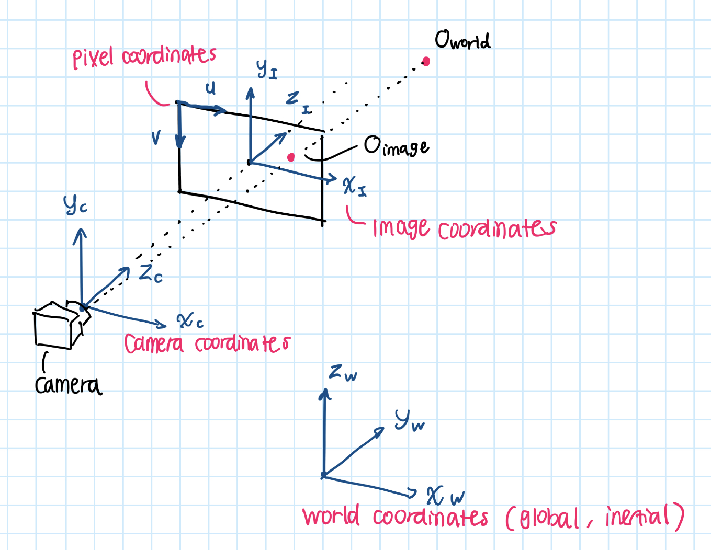
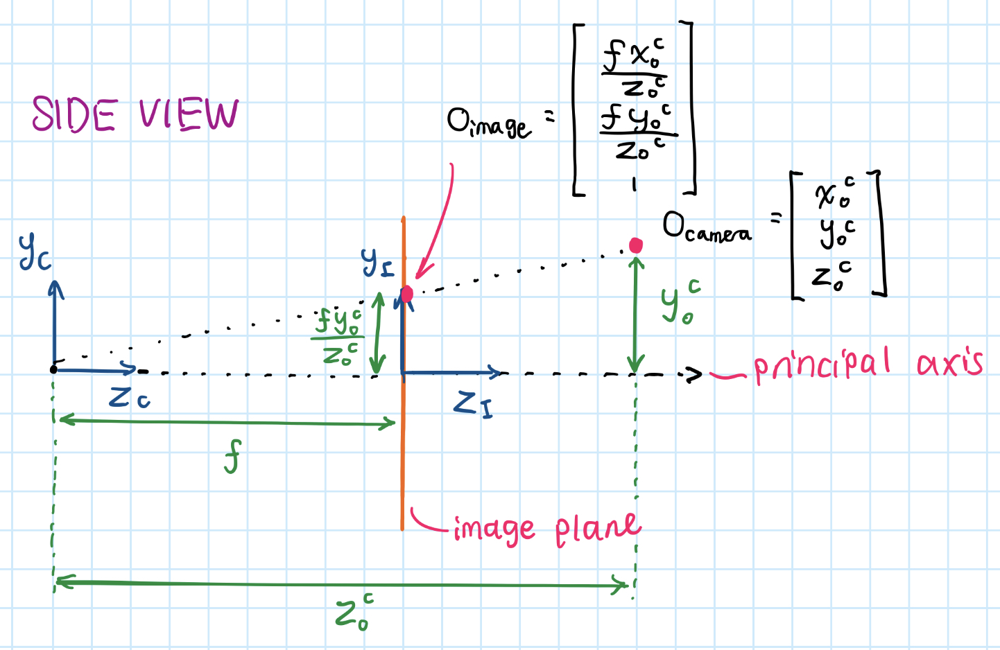
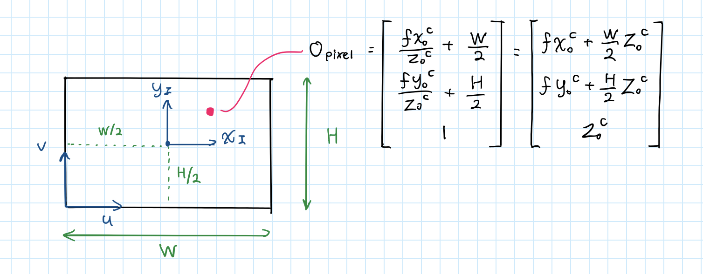
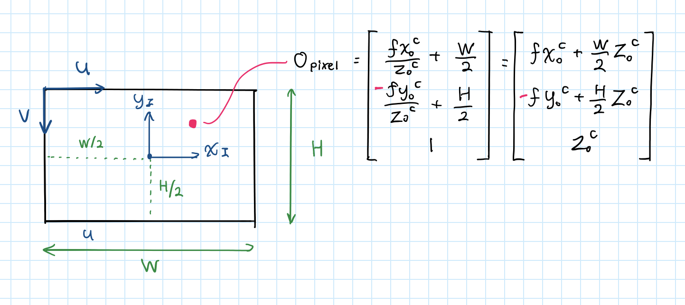
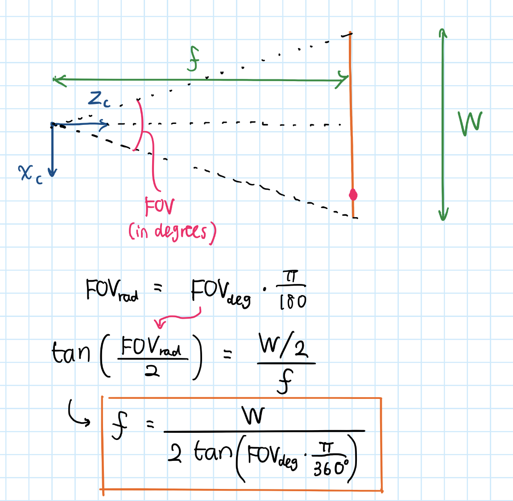
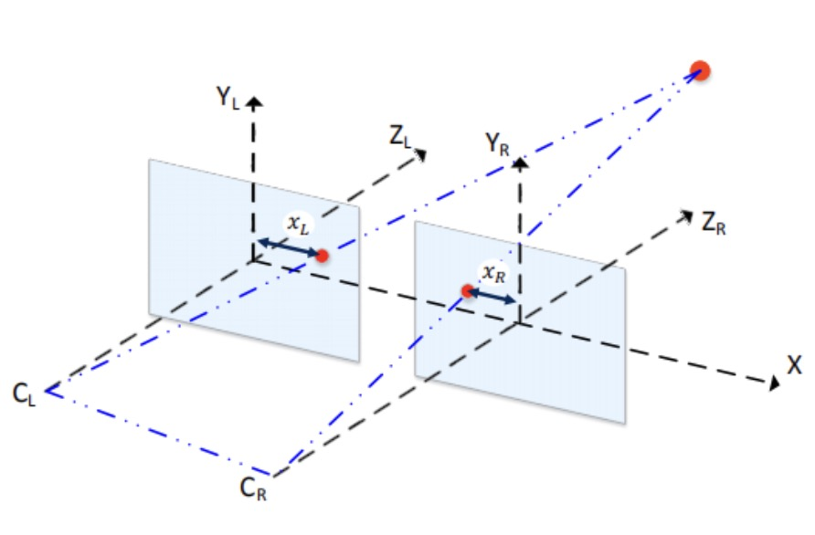
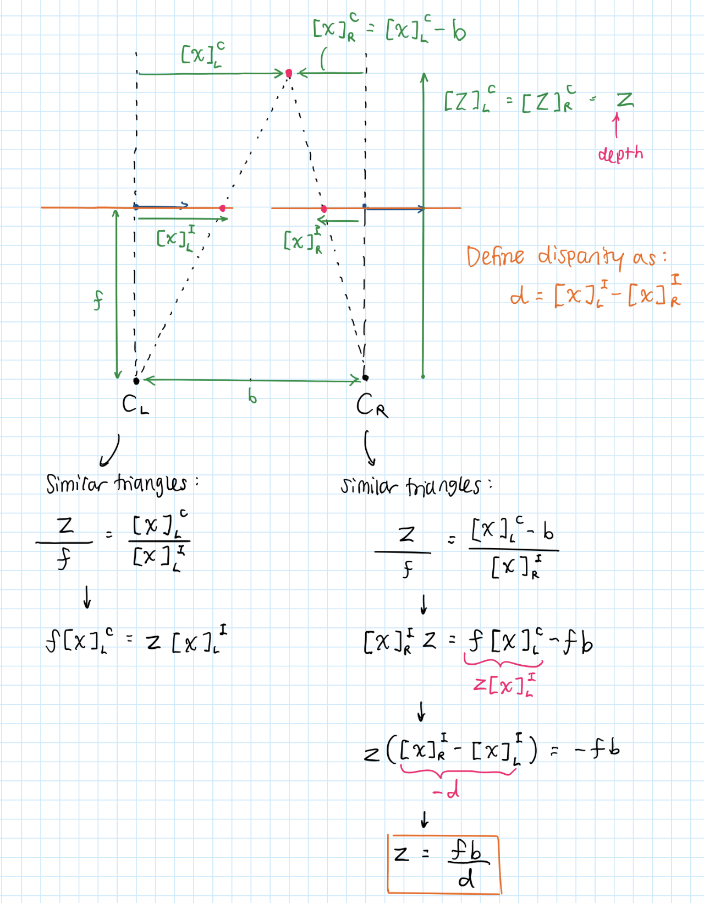
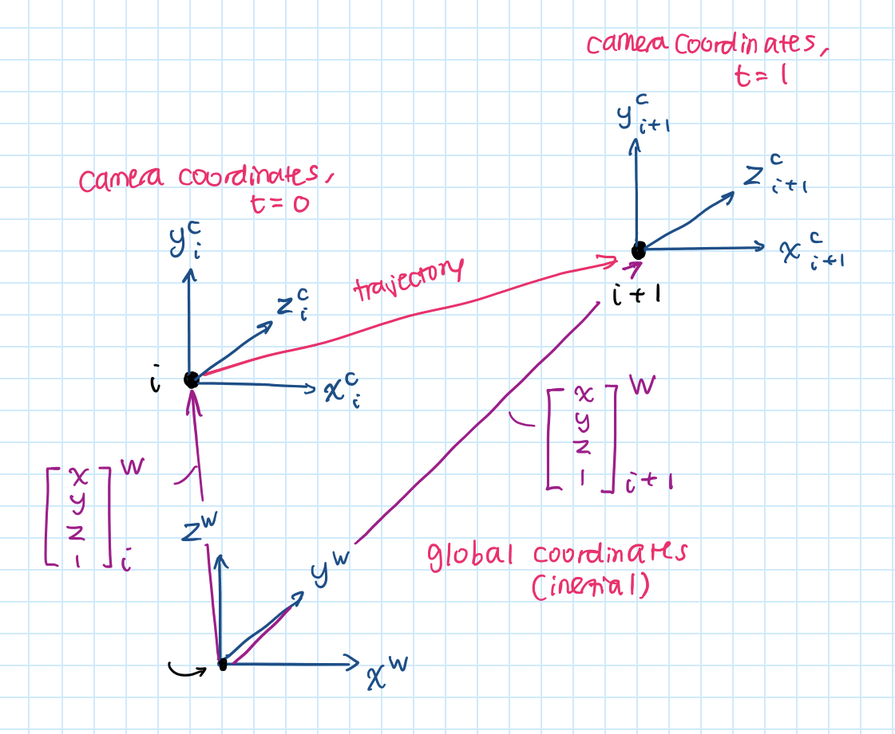
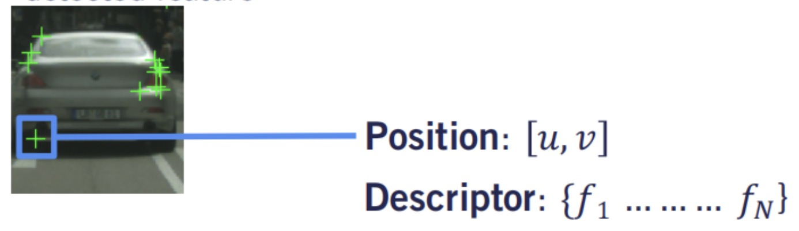
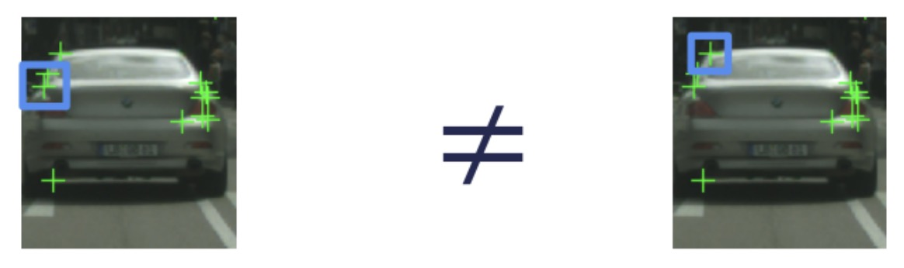

# Visual Odometry

**Motivation**

When I was building my Kalman Filter, I got a pretty good grasp of how IMUs and GNSS, two prominent sensors used in autonomous cars, can help capture a vehicle's trajectory.

In this project, I wanted to challenge myself by using cameras, one of the most powerful sensors, to estimate a vehicle's trajectory via visual odometry.

​

1. First, the disparity between the left and right image frames was calculated using StereoSGBM (users can manually switch to StereoBM).
2. Then, that disparity was used to create a depth map.
3. Feature extraction was performed using the ORB (Oriented FAST and Rotated BRIEF) feature extractor and descriptor.
4. Then, features between the current frame and previous frame were matched using the Brute Force Matcher.
5. By movement of those features were used to estimate the motion between the two relative frames. The rotation and translation between the current and previous frames were computed using the PnP and RANSAC algorithms.
6. Through recursion, the trajectory of the vehicle in the global frame was updated.

**Working Video**

[https://drive.google.com/file/d/1ztxZ5P-hhEPkfXok3fLLxexhDg4tke9r/view?usp=drive_link](https://drive.google.com/file/d/1ztxZ5P-hhEPkfXok3fLLxexhDg4tke9r/view?usp=drive_link)

**Visual Odometry Basics**

- We have four basic coordinates we care about:
    1. The **world coordinates**, which is an inertial frame that represents everything in the map (including the car, camera, object in question) in terms of global coordinates.
        - The object in question in the world frame would be represented in terms of $x^w,y^w,z^w$:
            
            $$
            [O]^W=
            \begin{bmatrix}
            x^w\\
            y^w\\
            z^w
            \end{bmatrix}
            $$
            
    2. The **camera coordinates**, which is centered on the position of the camera 
        
        $$
        \begin{aligned}
        [O]^C&=[T]^{CW}[O]^W\\
        &=[R|t]^{CW}[O]^W
        \end{aligned}
        $$
        
        - $T$ is the **extrinsic matrix** that converts world coordinates to camera coordinates
            - AKA, what rotation and translation do I need to convert from the world coordinates to the camera coordinates?
    3. The **image coordinates**, which represents the projection of 3D points in camera coordinates onto the 2D image plane 
        
        $$
        [O]^I=K[O]^C
        $$
        
        - $K$ is the **intrinsic matrix**, which projects the 3D points in the camera coordinate system onto the 2D image plane.
    4. The **pixel coordinates**, which is a **discrete** coordinate system used to identify the location of pixels in the digital image.

**Homogeneous Coordinates**

- In homogeneous coordinates…
    - A 2D point $\begin{bmatrix}
    u\\v
    \end{bmatrix}$can be represented as $\begin{bmatrix}
    u\\v\\1
    \end{bmatrix}$
    - A 3D point $\begin{bmatrix}
    x\\y\\z
    \end{bmatrix}$can be represented as $\begin{bmatrix}
    x\\y\\z\\1
    \end{bmatrix}$
- The idea is that scaling a homogeneous coordinate by a non-zero scalar does NOT change the physical point they represent. Thus:
    
    $$
    \begin{bmatrix}
    u\\v\\1
    \end{bmatrix}
    =
    \begin{bmatrix}
    ku\\kv\\k
    \end{bmatrix}
    \qquad\forall k\ne0
    $$
    

**Computing the Intrinsic Matrix**

- Let the object in the camera coordinates be represented as:
    
    $$
    [O]^C=\begin{bmatrix}
    x_O^C\\y_O^C\\z_O^C
    \end{bmatrix}
    $$
    
- Through similar triangles:
    
    
    
    - Thus, the object $O$ in image coordinates is:
        
        $$
        \begin{aligned}
        [O]^I=\begin{bmatrix}
        f\frac{x_O^C}{z_O^C}\\
        f\frac{y_O^C}{z_O^C}\\1
        \end{bmatrix}
        \end{aligned}
        $$
        
- Define $W,H$ as the width and height of the image
- If the **pixel coordinates** and **image coordinates** have the same orientation:
    
    
    
    - Thus, the object $O$ in **pixel coordinates** is:
        
        $$
        \begin{aligned}
        [O]^P&=
        \begin{bmatrix}
        fx_O^C+\frac{W}2z_O^C\\
        fy_O^C+\frac{H}2z_O^C\\
        z_O^C
        \end{bmatrix}
        \\
        &=
        \underbrace{
        \begin{bmatrix}
        f & 0 & \frac{W}2\\
        0 & f & \frac{H}2\\
        0 & 0 & 1
        \end{bmatrix}
        }_K
        \underbrace{
        \begin{bmatrix}
        x_O^C\\
        y_O^C\\
        z_O^C
        \end{bmatrix}
        }_{[O]^C}
        \end{aligned}
        $$
        
- However, if the pixel coordinates are arranged like this:
    
    
    
    - The **intrinsic matrix** would be a little different:
        
        $$
        \begin{aligned}
        [O]^P&=
        \begin{bmatrix}
        fx_O^C+\frac{W}2z_O^C\\
        \red-fy_O^C+\frac{H}2z_O^C\\
        z_O^C
        \end{bmatrix}
        \\
        &=
        \underbrace{
        \begin{bmatrix}
        f & 0 & \frac{W}2\\
        0 & \red-f & \frac{H}2\\
        0 & 0 & 1
        \end{bmatrix}
        }_K
        \underbrace{
        \begin{bmatrix}
        x_O^C\\
        y_O^C\\
        z_O^C
        \end{bmatrix}
        }_{[O]^C}
        \end{aligned}
        $$
        

**Calculating the focal length $f$ from FOV**: 

$$
f=\frac{W}{2\tan(\text{FOV}_{deg}\cdot\frac\pi{360})}
$$

**Calculating Disparity and Depth**

- Define the **disparity** $d$ as the difference between the image coordinates of the same pixel in the left and right images in the **image coordinates**:
    
    $$
    d=[x]_L^I-[x]_R^I
    $$
    
- If there was only one feature to calculate the disparity for, this would be easy, but an image would have hundreds of features that may all differ a bit in disparity. Thus, OpenCV has algorithms like **Semi-Global Block Matching (SGBM)** that uses en optimization process to find the most probable disparity value.

$$
z=\frac{fb}d
$$

**Motion Estimation**

- The **motion estimation** problem formulation is usually as follows:
- **Objective**: obtain $\begin{bmatrix}
x\\y\\z\\1
\end{bmatrix}^W_{i+1}$, the coordinates of the camera at frame $i+1$ in the global frame
- **Known**:
    - $\begin{bmatrix}
    x\\y\\z\\1
    \end{bmatrix}^W_{i}$: coordinates of camera at frame $i$ in the global frame
    - $[R|t]^{C_iW}$: transformation matrix from global frame → camera frame at frame $i$
        - Obtained through past recursion + initialization
    - $[R|t]^{C_{i+1}C_i}$: transformation matrix from camera frame at $i$ → camera frame at $i+1$
        - Obtained through PnP algorithm + RANSAC

- Then, the equation becomes, recursively:
    
    $$
    \begin{bmatrix}
    x\\y\\z\\1
    \end{bmatrix}^W_{i+1}=([R|t]^{C_iW})^{-1}
    ([R|t]^{C_{i+1}C_i})^{-1}
    \begin{bmatrix}
    x\\y\\z\\1
    \end{bmatrix}^W_{i}
    $$
    

**Computer Vision**

**Feature Extractor**

- In this project, we utilize the ORB feature extractor and descriptor.
- We define a feature point by its coordinates $u$ and $v$ in the image frame
- We describe a **descriptor** $f$ as an $n$-dimensional vector associated with each feature

- As with feature detectors, descriptors should be **repeatable**, which means that regardless of shifts in position, scale, and illumination, the same point of interest in two images should have approximately the same descriptor
    
    
    
- The feature descriptors should be **distinctive**, meaning it should allow us to distinguish between two close-by features
    
    
    
- The feature descriptors should also be **compact** and **efficient to compute**

**Feature Matching**

- In this project, we utilize a **brute force feature matcher** to match features between two frames:
- The **Brute Force Feature Matching** algorithm is as follows:
    1. Define a distance function $d(f_i,f_j)$ that compares two descriptors
    2. Define distance ratio threshold $\rho$
    3. For every feature $f_i$ in image 1:
        1. Compute $d(f_i,f_j)$ with all features $f_j$ in image 2
        2. Find the closest match $f_c$ and second closest match $f_s$
        3. Compute the distance ratio $\frac{d(f_i,f_c)}{d(f_i,f_s)}$
        4. Keep this match only if $\frac{d(f_i,f_c)}{d(f_i,f_s)}<\rho$

**Outlier Rejection**

- **RANSAC Algorithm**:
    1. Given a model for identifying a problem solution from a set of data points, find the smallest number $M$ of data points or samples needed to compute the parameters of this model (e.g. $t_u$ and $t_v$ offsets of least square solution)
    2. Randomly select $M$ samples from data
    3. Compute model parameters using only the selected $M$ samples
    4. Use the computed parameters and count how many of the remaining data points agreed with this computed solution
        - Accepted points: **inliers**
    5. If the number of inliers $C$ is satisfactory, or if the algorithm has iterated a pre-set maximum number of iterations, terminate and return the computed solution and inlier set
        - Else, go back to step 2
    6. Recompute model parameters from entire best inlier set

**Perspective N Point (PNP) for Extrinsic Matrix Estimation**

- **Perspective N Point Algorithm**:
    - Given: feature locations in 3D, corresponding projection in 2D, and camera intrinsic calibration matrix $K$
    1. Use **Direct Linear Transform (DLT)** to solve for an initial guess for $R$ and $t$
        - This requires a linear model but we have nonlinear equations in $R$ and $t$
    2. Refine the initial DLT solution with an iterative nonlinear optimization technique called the **Levenberg-Marquardt Algorithm (LM)**
        - PNP requires at least 3 features to solve $R$ and $t$ (4 if we don’t want ambiguous solutions)
    3. Use RANSAC to handle outliers
- `cv2.solvePnP()`: solves for camera position given 3D points in frame $k-1$, their projection in frame $k$, and the camera intrinsic calibration matrix
- `cv2.solvePnPRansac()`: same as above but uses RANSAC to handle outliers